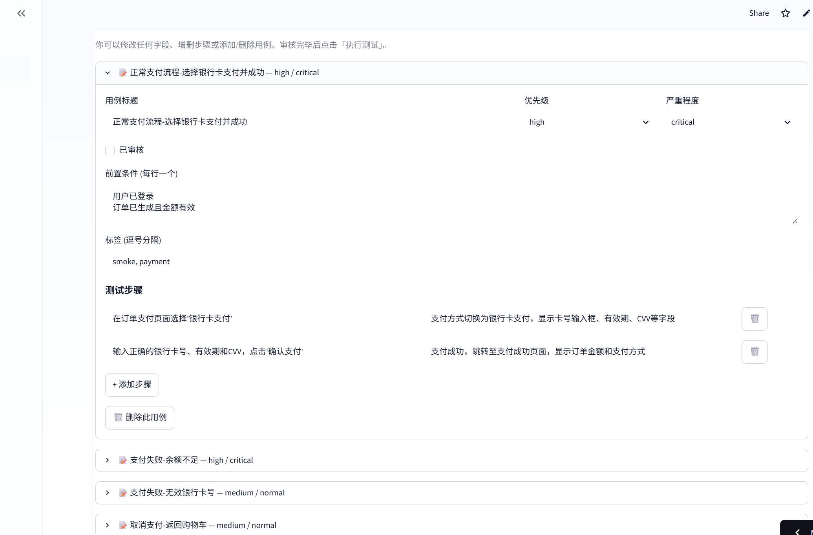

# Testcode — AI 驱动的自动化测试平台

[](https://github.com/caijin931/Test_code/actions/workflows/ci.yml)

Testcode 是一个基于 Python 的 AI 辅助自动化测试编排平台，集成 Dify、Coze、n8n 三大引擎，实现从自然语言需求输入到测试报告生成的全流程自动化。

- 🚀 **在线体验**: [Streamlit Cloud](https://share.streamlit.io/)
- 🌐 **项目官网**: [GitHub Pages](https://caijin931.github.io/Test_code/)



## 功能概览

| 模块 | 说明 | AI 引擎 |
|------|------|---------|
| 📋 功能测试 | 输入需求描述 → AI 生成测试用例 → 可编辑审核 → n8n 执行 | Dify + Coze |
| 🔌 接口测试 | 描述 API 场景 → AI 生成端点定义 → 断言验证 → 响应时间图表 | Coze |
| ⚡ 性能测试 | 描述压测场景 → AI 推荐配置 → 异步并发引擎 → 实时趋势图 | Dify |

所有模块均采用 **3 步向导式界面**：输入需求 → AI 生成 + 在线编辑审核 → 执行并生成可视化报告。

## 安装

### 本地开发

1. 创建 Python 3.11+ 虚拟环境并激活。
2. 安装项目及开发依赖：

```bash
pip install -e .[dev]
```

### Docker

构建镜像：

```bash
docker build -t testcode:latest .
```

运行容器并挂载配置文件：

```bash
docker run --rm \
  -e TESTCODE_COZE_ACCESS_TOKEN=your-token \
  -e TESTCODE_DIFY_API_KEY=your-key \
  -v ${PWD}/config:/app/config \
  testcode:latest health --settings config/settings.example.yaml
```

### Docker Compose

复制环境变量示例文件：

```bash
cp .env.example .env
```

启动服务（含 Redis 缓存和 n8n 工作流引擎）：

```bash
docker compose up --build
```

服务组件：

- `app` — Testcode CLI/运行时容器
- `redis` — Dify 缓存后端（可选）
- `n8n` — 本地工作流引擎，用于 Webhook 触发的自动化执行

## 配置

使用 `config/settings.example.yaml` 作为配置模板。

### 核心配置

| 配置项 | 说明 |
|--------|------|
| `coze.access_token` | Coze 个人访问令牌 |
| `coze.bot_id` | Coze 机器人 ID |
| `coze.base_url` | Coze API 地址（国内: `api.coze.cn`） |
| `coze.timeout_seconds` | 请求超时时间 |
| `dify.api_key` | Dify 应用 API 密钥 |
| `dify.base_url` | Dify API 地址 |
| `dify.timeout_seconds` | 请求超时时间 |
| `n8n.base_url` | n8n 服务地址 |
| `n8n.timeout_seconds` | 请求超时时间 |

### 环境变量

前缀默认为 `TESTCODE_`，支持以下变量：

`TESTCODE_COZE_ACCESS_TOKEN`、`TESTCODE_COZE_BOT_ID`、`TESTCODE_COZE_BASE_URL`、`TESTCODE_COZE_TIMEOUT_SECONDS`、`TESTCODE_DIFY_API_KEY`、`TESTCODE_DIFY_BASE_URL`、`TESTCODE_DIFY_TIMEOUT_SECONDS`、`TESTCODE_DIFY_CACHE_ENABLED`、`TESTCODE_DIFY_CACHE_DIRECTORY`、`TESTCODE_DIFY_CACHE_TTL_SECONDS`、`TESTCODE_DIFY_CACHE_BACKEND`、`TESTCODE_DIFY_CACHE_REDIS_URL`、`TESTCODE_DIFY_CACHE_REDIS_PREFIX`、`TESTCODE_N8N_BASE_URL`、`TESTCODE_N8N_TIMEOUT_SECONDS`

## 快速开始

1. 准备配置文件 `config/settings.example.yaml`。
2. 配置环境变量或填入密钥。
3. 运行健康检查：

```bash
python -m testcode health --settings config/settings.example.yaml
```

4. 运行完整测试流程：

```bash
python -m testcode run-test-flow \
  --settings config/settings.example.yaml \
  --requirement "测试登录功能" \
  --n8n-webhook-url https://example.com/webhook \
  --output artifacts/report.json
```

5. 查看缓存状态：

```bash
python -m testcode cache-health --settings config/settings.example.yaml
```

## CLI 命令

| 命令 | 说明 |
|------|------|
| `health` | 打印编排器健康状态 |
| `cache-health` | 检查 Dify 缓存后端状态 |
| `run` | 运行 Provider 链演示 |
| `run-test-flow` | 执行完整的测试生成与自动化流程 |
| `api-test` | 执行接口/API 测试 |
| `perf-test` | 执行性能/负载测试 |

## Web 可视化界面

```bash
streamlit run src/testcode/web_ui.py
```

浏览器自动打开，提供 4 个标签页：

- **功能测试** — AI 生成测试用例，在线编辑后一键执行
- **接口测试** — AI 生成 API 端点定义，支持 JSONPath 断言与响应时间图表
- **性能测试** — AI 推荐压测参数，异步并发引擎 + 实时 P50/P95/P99 趋势图
- **报告中心** — 历史报告浏览、搜索、下载和删除

### Streamlit Cloud 部署

项目已配置 `streamlit_app.py` 和 `requirements.txt`，可直接在 [share.streamlit.io](https://share.streamlit.io) 一键部署。API 密钥通过 Settings → Secrets 配置，支持密码门禁保护。

## 技术架构

### 执行流程

```
用户输入需求 → Dify 生成测试用例 → Coze 增强测试数据 → n8n 执行自动化 → 生成报告
```

### 各组件职责

| 组件 | 职责 |
|------|------|
| **Dify** | 根据自然语言需求生成结构化测试用例，生成测试报告摘要 |
| **Coze** | 根据测试用例智能生成测试数据和浏览器配置 |
| **n8n** | 接收自动化载荷，执行 Playwright 等自动化工作流并返回结果 |

### 降级策略

AI 服务不可用时自动回退到模板模式，不影响平台正常使用。n8n 不可用时标记为"降级"状态，测试用例和报告仍正常生成。

## 项目结构

```
Testcode/
├── src/testcode/          # 应用核心代码
│   ├── adapters/          # Dify/Coze/n8n Provider 适配器
│   ├── models/            # Pydantic v2 数据模型
│   ├── providers/         # Provider 注册与缓存
│   ├── cache/             # Dify 缓存（文件/Redis）
│   └── config/            # 配置加载
├── config/                # 环境与 Provider 配置文件
├── tests/                 # 单元测试与集成测试（87 通过 / 96 总计）
├── docs/                  # 项目官网与架构文档
├── artifacts/             # 生成的测试报告（不纳入版本控制）
├── streamlit_app.py       # Streamlit Cloud 部署入口
└── requirements.txt       # Python 依赖清单
```

## 测试

```bash
# 运行全部测试
pytest

# 运行集成测试
pytest -m integration

# 运行覆盖率报告
pytest --cov=testcode --cov-report=term-missing --cov-report=html
```

## 注意事项

- Redis 缓存为可选组件。Redis 不可用时自动降级为文件缓存。
- 如果遇到 `RedisDifyCache` 导入错误，请重新运行 `pip install -e .[dev]`。
- 密钥和令牌**不要提交**到版本控制，使用环境变量或 Streamlit Secrets 管理。
- 生成的报告存放在 `artifacts/` 目录，不应提交到 Git。
