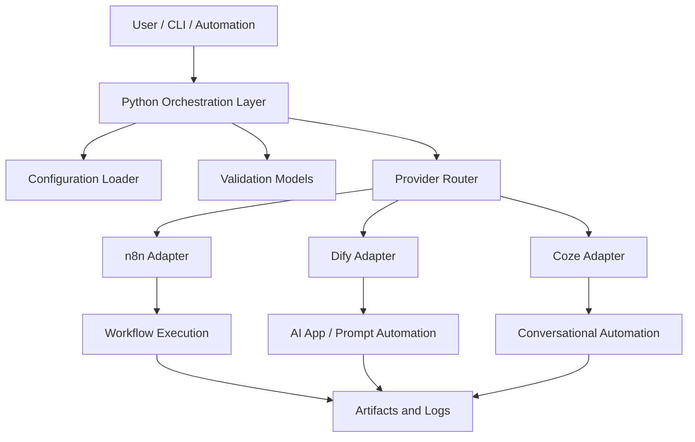

# Architecture

## Responsibilities

- `src/` contains the Python orchestration layer.
- `config/` stores runtime configuration for environments and providers.
- `scripts/` holds automation helpers for setup, release, and maintenance.
- `tests/` validates orchestration behavior and provider contracts.
- `artifacts/` stores generated output and intermediate deliverables.

## Workflow

1. Load configuration from `config/` and environment variables.
2. Validate workflow inputs with Pydantic models.
3. Route orchestration requests to the appropriate provider adapter.
4. Execute provider-specific actions in n8n, Dify, or Coze.
5. Log results and store generated outputs in `artifacts/` when needed.

## Mermaid diagram

